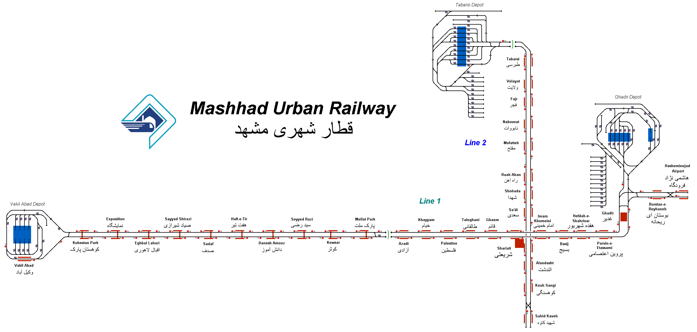

# Mashhad Urban Railway
A simulation of the Mashhad Urban Railway the metro system for the city of Mashhad, the capital of Iran's Razavi Khorasan Province.
This simulation is semi-fictional, although the route is accurate, exact speed limits are unknown and the timetables are only accessible within Iran itself, I managed to get access to a single direction timetable for Line 1.

## Current Status

| Stage         | Status        |
| ------------- |:-------------:|
| Track Plan     | :heavy_check_mark: |
| Signalling      | :heavy_check_mark:      |
| Naming | :heavy_check_mark:      |
| Speed Limits | :heavy_check_mark: |
| Distances | :heavy_check_mark: |
| Timetable | :heavy_check_mark: |
| Documentation | :heavy_check_mark: |

## Development

If you have any suggestions or improvements or further data sources to improve the realism of this simulation do open an issue and let me know! Contributions are also welcome.

## Data Sources

- [Carto Metro Paris Metro Map](http://carto.metro.free.fr/cartes/metro-paris/)
- [Iran Subway In Mashhad City 2022 by Mary Travel, Youtube](https://www.youtube.com/watch?v=Ty1XtJu2kRE&t=148s)
- Metro timetable (unavailable outside Iran)
